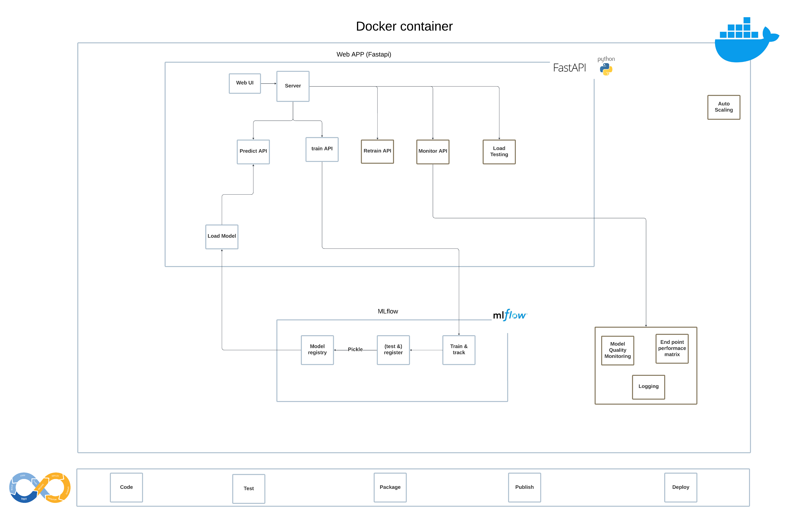

# ✨ Personal Note

First of all, let me just say — I absolutely loved working on this project and exploring ways to turn a notebook into a full ML app.

---

# 📈 Promo Uplift ML Application

This project contains a machine learning application that predicts sales uplift during promotional campaigns for Albert Heijn. The application is built using **FastAPI** for the web interface, **MLflow** for experiment tracking and model serving, and **Docker** for containerized deployment.

My vision was to build a platform where a user could Train, Predict, See training progress, Retrain the model, Monitor model performance and Load test the model. Additionally, I also wanted to include unit tests and integration tests. And, lastly, I also wanted to deploy it to the cloud using a CI/CD pipeline.  
Since in this task, I'm assuming hyperparameter tuning isn't necessary, it could have been implemented in the training module while tracking via MLflow — allowing the best model to be registered and served.

However, due to the limited time, I decided to mainly focus on **train** and **test**, among many other ideas I envisioned.

---

## 🔍 Assumptions

1. Data is already clean and preprocessed  
2. The provided model is adequate for production – no hyperparameter tuning  
3. Model input/output shape is consistent  
4. No retraining on new data for now – training is manual or on demand  
5. A single machine is sufficient (e.g., local dev, Docker, or lightweight cloud VM)  
6. Inference can be one-off or served via API     
7. Model artifacts are stored locally  
8. Model to be loaded only once  
9. Read/write paths are relative  
10. No actual CI/CD pipeline implemented, but will be discussed  
11. No need for complex orchestration tools  

---

## 📋 Requirements

Make sure to have the following installed:

- Docker / Podman
- Python 3.11

Python dependencies are listed in `requirements.txt`.

---

## 🚀 Features

- **📦 FastAPI web app** for training and inference  
- **🧠 MLflow integration** for experiment tracking, model logging, and serving  
- **🐳 Dockerized deployment** for both the web server and MLflow UI  
- **📡 Train and Predict APIs** with background job support for long-running processes  
- **🧪 Placeholder retraining, monitoring & load testing endpoints**  
- **🗂 Logs and artifacts** managed locally, but architecture ready for production  

---

## 🧱 Architecture Overview



```plaintext
Client --> FastAPI App --> Training Module --> MLflow (local server)
                                 |
                                 --> Saved model (local + MLflow artifact)
                                 --> Inference API
```

In production, this can be extended to:
- Host FastAPI + MLflow on AWS **EC2**  
- Use **S3** for MLflow artifacts and log storage  
- Add **Celery + Redis** for scalable background jobs  
- Use **CloudWatch** or similar for monitoring  
- Use **Locust** or similar for load testing  
- Add load balancers for the web server (based on traffic)

---

## 🧪 API Endpoints

| Endpoint | Method | Description |
|----------|--------|-------------|
| `/train` | POST   | Triggers model training in the background |
| `/predict` | POST | Runs inference on new data |
| `/retrain` | GET  | Placeholder for retraining workflow |
| `/monitor-training` | GET | Rudimentary logs viewer for training runs |
| `/monitor-performance` | GET | Placeholder for model performance dashboard, end point performace matrix |
| `/load-test` | GET | Placeholder for performance for load testing |

---

## ⚙️ How to Run

### 1. Clone and Navigate  
Download the ZIP file and go to the project directory in your terminal.

### 2. Run with Script, to build and run a container
Use the provided shell script to build and start the application:

```bash
chmod +x run-promo-app.sh
./run-promo-app.sh
```

The above steps will:
- Build the Docker image (`promo-forecast-app`)
- Run the container with memory limit
- Launch the FastAPI server on `http://localhost:8000`
- Launch the MLflow server on `http://localhost:8080`

OR instead of running shell script in Step 2, you could also run the following commands individually in the terminal to start the servers.

### 2a. Build the container
```bash
docker build -t promo-forecast-app .
```

### 2b. Run the container with memory limit
```bash
docker run --rm --memory="5g" --name promo-forecast-app-container -p 8080:8080 -p 8000:8000 promo-forecast-app
```

### 4. Access
- **FastAPI Swagger UI**: [http://localhost:8000](http://localhost:8000)  
- **MLflow UI**: [http://localhost:8080](http://localhost:8080)

---

## 🖥 UI Walkthrough

### FastAPI UI (Swagger)

Goto: [http://localhost:8000](http://localhost:8000)
- Step 1. Click on **Train** button to start the training
- Step 2. Go back to home page by clicking back arrow in the browser
- Step 3. You could click **Monitor Training** to see trainign logs
- Step 4. Go back to home page by clicking back arrow in the browser
- Step 5. Click on **Predict** after filling in the form provided
- Step 6. Click on **Monitor Performance** to keep track of inputs with their predicted values
- Step 7. Click on **Retrain** or **Load Testing**, these are just placeholders

### MLflow UI
Available at: [http://localhost:8080](http://localhost:8080)

Tracks:
- Parameters used in training
- Metrics (currently minimal)
- Artifacts like saved models

---

## 📂 Project Structure

```
project/
│
├── app/
│   ├── templates/          # FastAPI UI             
|   ├── schemas.py          # Schemas
│   └── main.py             # FastAPI app
│
├── configs/                # configs
├── data/                   # data (project level - can be store somewhere permanent and loaded as volume for efficiency)
├── src/                    # Core logic: training, inference
├── mlruns/                 # MLflow experiment tracking (container level - can be store somewhere permanent and loaded as volume)
├── models/                 # Saved model files for serving (container level - can be store somewhere permanent and loaded as volume)
├── logs/                   # contains the logs (container level - can be store somewhere permanent and loaded as volume)
├── tests                   # placeholder for tests
├── Dockerfile
├── run-promo-app.sh        # script to run the project
├── .gitignore              # gitignore
├── .pre-commit-config.yaml # coding stype and linting
├── requirements.txt        # required packages
└── README.md

```

---

## 🛠 Engineering Assumptions & Limitations

- Training is triggered via API and runs **as a background task** to avoid blocking.
- **Celery** was considered for background task management, but due to the simplicity of the system and time limitations, it's not implemented. Instead, `BackgroundTasks` and `gunicorn` with workers was used.
- ML models are saved **locally and as MLflow artifacts**; in production, these should be stored in **S3 or similar**.
- **Logging** is rudimentary and local. Cloud-based centralized logging (e.g., AWS CloudWatch) is recommended for production.
- The **monitoring and load testing endpoints are placeholders** to show how they could be structured.
- **Unit testing is not included** due to time constraints, but the project is structured for testability.

---

## 🚀 Deployment in Production

Suggested production stack:
- **FastAPI app** hosted on **AWS EC2**
- **Data** stored in **Redshift**, **RDS** or **S3**
- **MLflow server** also on EC2, or separate instance
- **Model artifacts/logs** stored in **S3**
- **Redis + Celery** for distributed training jobs
- **NGINX/Gunicorn** in front of FastAPI for load handling
- **Monitoring** via Prometheus/Grafana or AWS CloudWatch
- **Locust** for load testing
---

## 📌 To Improve (Given More Time)

- Integrate **Celery + Redis** for proper job queuing
- Add **unit/integration tests** and a CI/CD pipeline
- Expand training logs and metrics dashboards
- Secure MLflow access with basic auth or OAuth
- Better error handling and input validation
- Retraining module implementation

---

## 🙌 Closing Thoughts

I genuinely enjoyed building this project and am looking forward to walking you through my thought process during the interview.

---